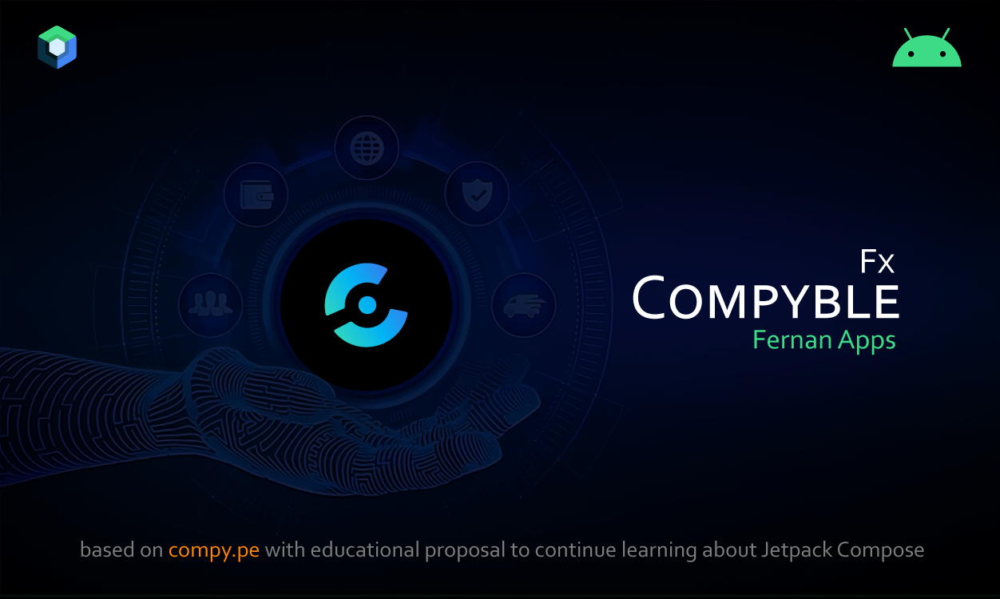
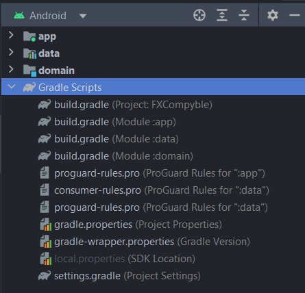
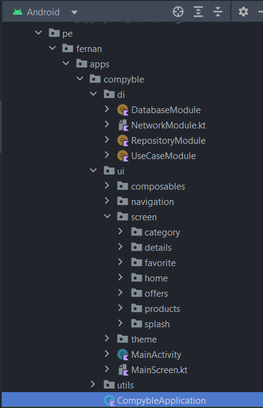
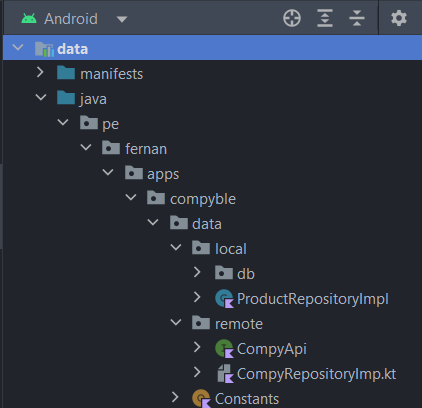
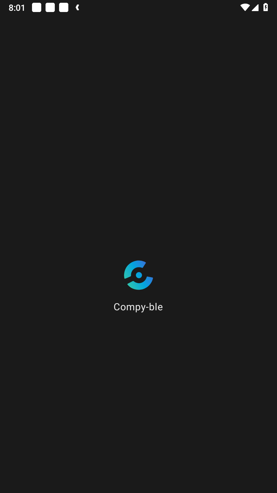

<h1 align="center">Fx - Compyble</h1>

<p align="center">
<a href="https://github.com/FernanApps/FXCompy-ble" title="Go"></a>
<br>
<a href="https://github.com/FernanApps/FXCompy-ble/releases/latest"></a>
  <a href="https://android-arsenal.com/api?level=21"></a> 

</p
</br>

<p align="center">

</p>

## **Introduction**
<p align="center">

</p>

<p align="center">  
🛒 Fx - Compyble: Welcome to our e-commerce application! We present a cutting-edge platform where you can explore and purchase a wide range of fashionable clothing and accessories, all from the comfort of your home. Leveraging the power of Appwrite as our backend solution, we have seamlessly integrated user management, product catalog, and order tracking features. To ensure secure and hassle-free transactions, we have integrated Stripe payment services, providing a robust and reliable payment gateway. Join us today for an immersive shopping experience, where fashion meets convenience at your fingertips. Be part of our journey as we revolutionize the way you shop online!".
</p>


## Description of Project

The project at hand is a mobile application developed for a hackathon event, aiming to revolutionize the fashion e-commerce industry by providing a user-friendly and secure shopping experience with simplified online payments. The application was built using AppWrite, a powerful backend-as-a-service platform, and integrated with Stripe, a leading online payment gateway.

### Features

- **Efficient Data Storage:** AppWrite efficiently stores and manages data, providing a seamless user experience. It optimizes data retrieval and storage, resulting in fast response times and minimal downtime.
- **Product Exploration:** Users can explore a vast selection of fashion items, including the latest trends, popular styles, and exclusive offers. The app provides intuitive search and filtering functionalities to help users discover their desired products easily.
- **Notifications:** Users receive timely notifications about their orders, including order confirmations, shipment updates, and delivery notifications. These notifications keep users informed and engaged throughout the shopping experience.

## Architecture


### Structure
This architecture allows for a clear separation of responsibilities, makes it easier to test and maintain code, and allows layers to be independent and can be modified or replaced without affecting other layers.

*This architecture is separated in modules*
<p align="center">
  
</p>


**Modules**


- **Presentation** is responsible for the user interface and user interaction. Here are the UI components and presentation logic. <br>  <br>  
   <br>
  <br>


-  **Data**   is responsible for data access and persistence. Here the repositories defined in the domain layer are implemented and frameworks and libraries are used to interact with data sources. <br> <br>  
    <br>


- **Domain**  is the core of the architecture and contains the main business logic of the application. Here the application-specific use cases and business rules are defined. <br><br>
  

  
## Screens
#### Splash
<div style="display: flex;">
  
</div>

#### Main
<div style="display: flex;">
  

</div>

#### Notifications
<div style="display: flex;">
  
</div>

#### Profile
<div style="display: flex;">
  
</div>

## Tech Stack
The Fx - Compyble App utilizes the following technologies:
- Minimum SDK level 21
- [Kotlin Coroutines](https://kotlinlang.org/docs/coroutines-overview.html) based for asynchronous.
- Jetpack
    - Lifecycle - Observe Android lifecycles and handle UI states upon the lifecycle changes.
    - ViewModel - Manages UI-related data holder and lifecycle aware. Allows data to survive configuration changes such as screen rotations.
    - DataBinding - Binds UI components in your layouts to data sources in your app using a declarative format rather than programmatically.
- Architecture
    - MVVM Architecture (View - DataBinding - ViewModel - Model)
- [Retrofit2](https://github.com/square/retrofit) - Construct the REST APIs.
- [Glide](https://github.com/bumptech/glide) - Loading images from network.
- [Material-Components](https://github.com/material-components/material-components-android) - Material design components for building ripple animation, and CardView.

## Download
Go to the [Releases](https://github.com/FernanApps/FernanEcommerceShop/releases) to download the latest APK.

## Preview


<!---

-->

## Tech stack & Open-source libraries
- Minimum SDK level 21
- [Kotlin Coroutines](https://kotlinlang.org/docs/coroutines-overview.html) based for asynchronous.
- Jetpack
    - Lifecycle - Observe Android lifecycles and handle UI states upon the lifecycle changes.
    - ViewModel - Manages UI-related data holder and lifecycle aware. Allows data to survive configuration changes such as screen rotations.
    - DataBinding - Binds UI components in your layouts to data sources in your app using a declarative format rather than programmatically.
- Architecture
    - MVVM Architecture (View - DataBinding - ViewModel - Model)
- [Retrofit2](https://github.com/square/retrofit) - Construct the REST APIs.
- [Glide](https://github.com/bumptech/glide) - Loading images from network.
- [Material-Components](https://github.com/material-components/material-components-android) - Material design components for building ripple animation, and CardView.
- [Stripe](https://dashboard.stripe.com) - _Stripe_ is a suite of APIs powering online payment processing and commerce solutions for internet businesses of all sizes. Accept payments and scale faster..


## Find this repository useful? :heart:
Also, __[follow me](https://github.com/FernanApps)__ on GitHub for my next creations! 🤩

## Inspired by :heart:
Also, __[follow](https://www.behance.net/gallery/136187429/Rika-eCommerce-Mobile-App)__ 😅

# License
```xml
- The code is: `-
```
