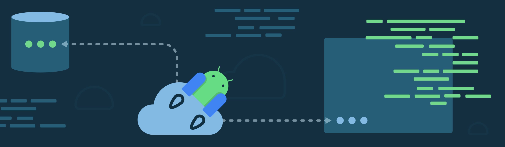
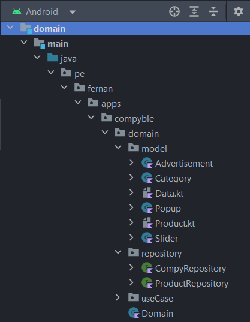
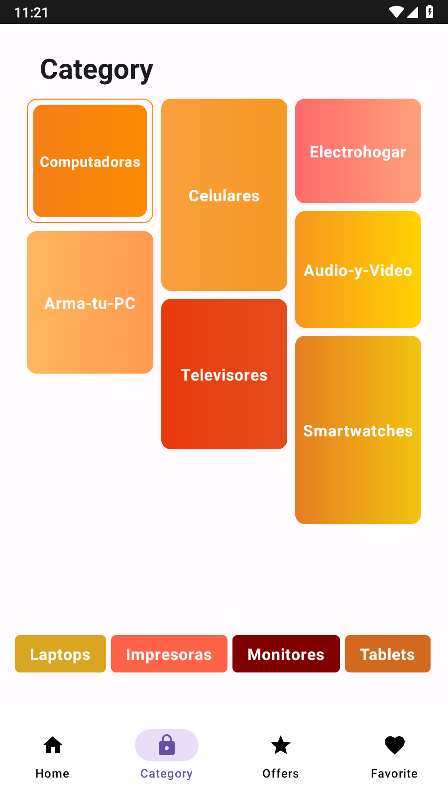
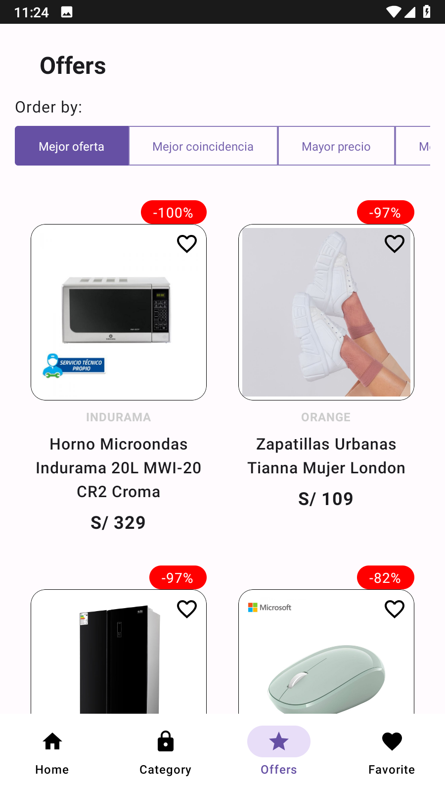
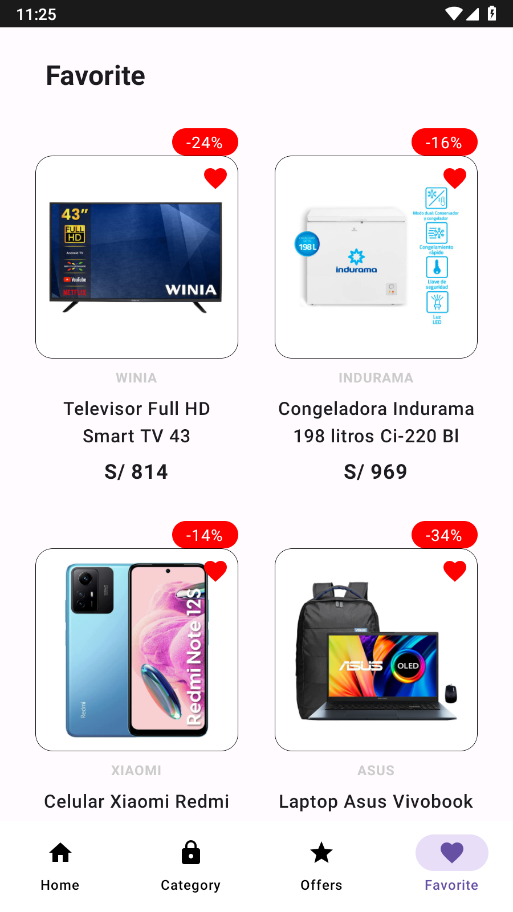
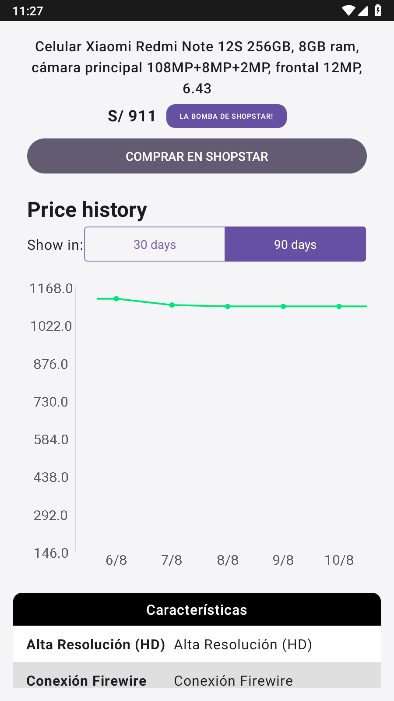

<h1 align="center">Fx - Compyble</h1>

<p align="center">
<a href="https://github.com/FernanApps/FXCompy-ble" title="Go"></a>
<br>
<a href="https://github.com/FernanApps/FXCompy-ble/releases/latest"></a>
  <a href="https://android-arsenal.com/api?level=21"></a> 

</p
</br>

<p align="center">

</p>

## **Introduction**
<p align="center">

</p>

<p align="center">  
🛒 Fx - Compyble: It is based on the compy.pe website with the proposal to continue learning jetpack compose.
</p>

## Architecture


### Structure
This architecture allows for a clear separation of responsibilities, makes it easier to test and maintain code, and allows layers to be independent and can be modified or replaced without affecting other layers.

*This architecture is separated in modules*
<p align="center">
  
</p>


**Modules**


- **Presentation** is responsible for the user interface and user interaction. Here are the UI components and presentation logic. <br>  <br>  
   <br>
  <br>


-  **Data**   is responsible for data access and persistence. Here the repositories defined in the domain layer are implemented and frameworks and libraries are used to interact with data sources. <br> <br>  
    <br>


- **Domain**  is the core of the architecture and contains the main business logic of the application. Here the application-specific use cases and business rules are defined. <br><br>
  

  
## Screens
#### Splash
<div style="display: flex;">
  
</div>

#### Main
<div style="display: flex;">
  
</div>

#### Category
<div style="display: flex;">
  
</div>


#### Offers
<div style="display: flex;">
  
</div>

#### Favorite ❤️
<div style="display: flex;">
  
</div>

#### Details
<div style="display: flex;">
  
  
</div>


## Tech Stack
The Fx - Compyble App utilizes the following technologies:
- Minimum SDK level 21
- [Kotlin Coroutines](https://kotlinlang.org/docs/coroutines-overview.html) based for asynchronous.
- Jetpack
    - Lifecycle - Observe Android lifecycles and handle UI states upon the lifecycle changes.
    - ViewModel - Manages UI-related data holder and lifecycle aware. Allows data to survive configuration changes such as screen rotations.
    - DataBinding - Binds UI components in your layouts to data sources in your app using a declarative format rather than programmatically.
- Architecture
    - MVVM Architecture (View - DataBinding - ViewModel - Model)
- [Retrofit2](https://github.com/square/retrofit) - Construct the REST APIs.
- [Glide](https://github.com/bumptech/glide) - Loading images from network.
- [Material-Components](https://github.com/material-components/material-components-android) - Material design components for building ripple animation, and CardView.

## Download
Go to the [Releases](https://github.com/FernanApps/FernanEcommerceShop/releases) to download the latest APK.

## Preview


## Tech stack & Open-source libraries
- Minimum SDK level 21
- [Kotlin Coroutines](https://kotlinlang.org/docs/coroutines-overview.html) based for asynchronous.
- Jetpack
    - Lifecycle - Observe Android lifecycles and handle UI states upon the lifecycle changes.
    - ViewModel - Manages UI-related data holder and lifecycle aware. Allows data to survive configuration changes such as screen rotations.
    - DataBinding - Binds UI components in your layouts to data sources in your app using a declarative format rather than programmatically.
- Architecture
    - MVVM Architecture (View - DataBinding - ViewModel - Model)
- [Retrofit2](https://github.com/square/retrofit) - Construct the REST APIs.
- [Glide](https://github.com/bumptech/glide) - Loading images from network.
- [Material-Components](https://github.com/material-components/material-components-android) - Material design components for building ripple animation, and CardView.


## Find this repository useful? :heart:
Also, __[follow me](https://github.com/FernanApps)__ on GitHub for my next creations! 🤩

# License
```xml
- The code is: `-
```
